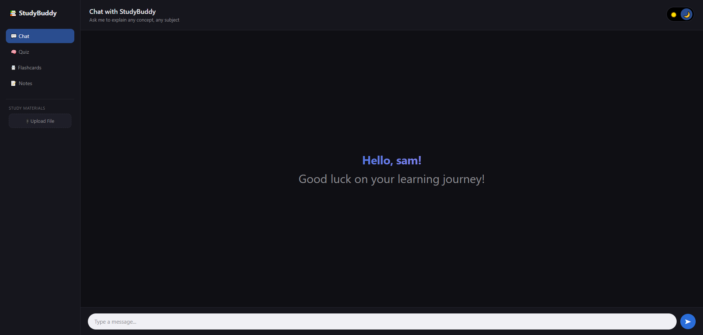
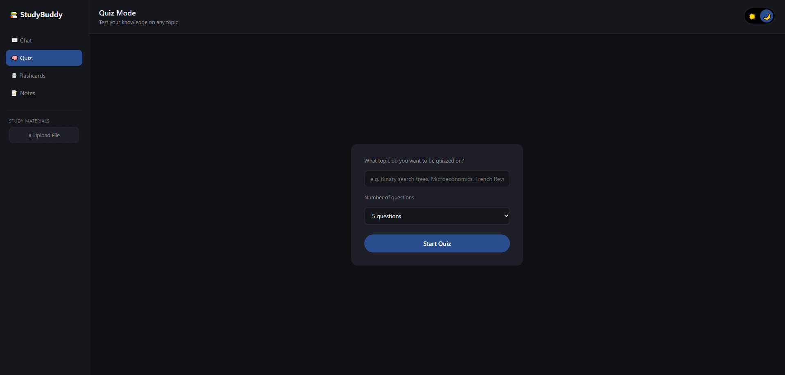
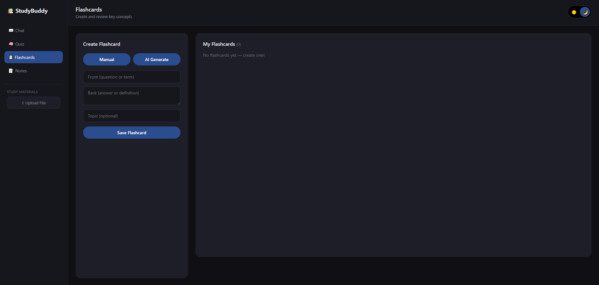
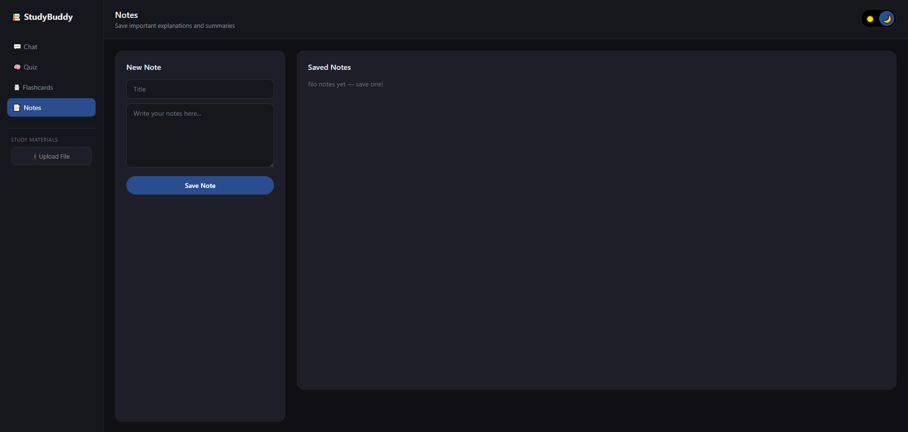

# StudyBuddy AI

An AI-powered study companion built with Python Flask and Ollama. Chat with an AI tutor, generate quizzes, create flashcards, and save notes — all running locally for free with no API costs.



## Features

- 💬 **AI Chat** — ask questions and get explanations on any subject
- 📎 **File Upload** — upload PDFs or text files and chat about their content
- 🧠 **Quiz Mode** — AI generates quiz questions on any topic and checks your answers
- 📇 **Flashcards** — create manually or generate in bulk with AI
- 📝 **Notes** — save important explanations for later review
- 👤 **Personalised greeting** — AI generates a custom welcome message using your name
- 💾 **Persistent storage** — flashcards and notes saved in SQLite database

## Screenshots

### Chat


### Quiz


### Flashcards


### Notes


## Tech Stack

- **Backend** — Python 3.13, Flask 3.1
- **AI** — Ollama (local LLM, Llama 3.2) — completely free, runs on your machine
- **Database** — SQLite (built into Python, no setup needed)
- **Frontend** — Vanilla HTML, CSS and JavaScript

## Getting Started

### Prerequisites

- Python 3.10+
- [Ollama](https://ollama.com) with Llama 3.2 installed

### Install Ollama model

```bash
ollama pull llama3.2
```

### Setup

1. Clone the repository
```bash
   git clone https://github.com/YOUR_USERNAME/studybuddy-ai.git
   cd studybuddy-ai
```

2. Create and activate a virtual environment
```bash
   python -m venv venv
   source venv/Scripts/activate   # Windows
   source venv/bin/activate       # Mac/Linux
```

3. Install dependencies
```bash
   pip install -r requirements.txt
```

4. Create the uploads folder
```bash
   mkdir uploads
```

5. Run the app
```bash
   flask --app app run --debug
```

6. Open your browser at `http://127.0.0.1:5000`

## Project Structure

studybuddy-ai/

├── app.py                  Flask backend and all API routes

├── studybuddy.db           SQLite database (auto-created on first run)

├── requirements.txt        Python dependencies

├── templates/

│   └── index.html          Main HTML page

├── static/

│   ├── css/

│   │   └── style.css       All styles

│   └── js/

│       └── main.js         Frontend JavaScript

├── uploads/                Uploaded study materials (PDFs, text files)

└── docs/                   Screenshots for README

## How It Works

All AI features are powered by a locally running Ollama instance — no internet connection or API keys required after setup. The Flask backend sends prompts to Ollama's REST API at `http://localhost:11434` and returns the responses to the frontend.

Uploaded files are processed by `pdfplumber` (for PDFs) or read directly (for text files), and the extracted text is stored in memory and injected into prompts as context when you ask questions or generate quizzes about them.

Flashcards and notes are stored in a local SQLite database that persists between sessions.

## License

This project is open source and available under the [MIT License](LICENSE).